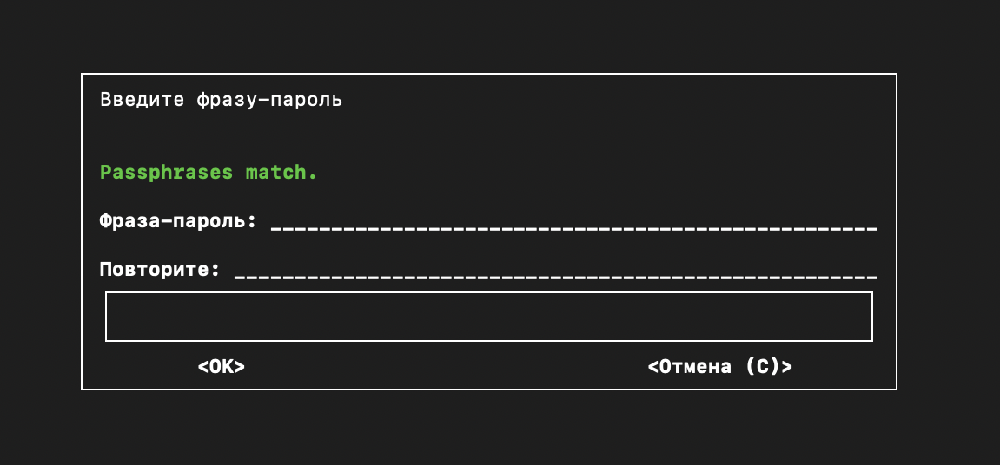

# Лабораторная работа "Шифрование и дешифрование файлов и каталогов с использованием GPG"

Я выбрала последнюю тему для создания лабораторной работы, однако специализировалась в ней именно на GPG

*Лабораторная работа может быть выполнена на виртуальной машине с установленным Linux, WSL (главное на линукс подобной системе)*

GPG использует шифрование с открытым ключом. Вы можете использовать чей-то открытый ключ для шифрования сообщения или документа таким образом, что только владелец соответствующего закрытого ключа сможет расшифровать его . Это отличный способ отправить кому-то строго конфиденциальные данные.


**Для начала требуется установить GPG, используя команду:**

   ```brew install gpg```

   **В данном случае указан homebrew, так как я прописываю задание в терминале MacOS, вы можете использовать аналоги установки на Linux*

**Проверить наличие GPG (версию) возможно с помощью:**

   ```  gpg --version```


# Часть 1: Шифрование файла

  **1) Создание текстового файла**

Создайте текстовый файл с произвольным содержимым. Его можно сохранить как `tekst.txt`. Наберите туда любой текст, который вы хотите зашифровать.

 **2) Шифрование файла с использованием GPG**
  
Откройте терминал и наберите команду для шифрования файла: 

```gpg -c tekst.txt```

При выполнении этой команды вам будет предложено ввести пароль для шифрования. 



Пароль должен быть достаточно объёмным в целях безопасности конфиденциальности, иначе может появиться следующее сообщение:


В случае данной работы разрешается создать простой пароль.

Убедитесь, что файл tekst.txt.gpg создан и зашифрован (можно просто открыть его в редакторе)

# Часть 2: Дешифрование файла

**Для расшифровки файла выполните команду:**
```gpg tekst.txt.gpg```

# Часть 3: Шифрование и дешифрование каталога

Шифрование и дешифрование каталогов немного отличается от файлов. 

**1) Создание тестового каталога**

Создайте новый каталог и несколько файлов с текстом внутри них:

     mkdir test_directory
     cd test_directory
     nano file1
     nano file2

**2) Формирование архива**

Создайте архив вашего каталога, используя следующую команду:

     tar -cvf test_directory.tar test_directory

*Не забудьте ввести перед этим cd, чтобы выйти из директории

**3) Шифрование, дешифрование**

Далее шифруйте созданный архив по аналогии с файлами:

     gpg -c test_directory.tar

Дешифрование так же происходит по аналогии.

# Итог

**Благодаря этой лабораторной работе можно научиться шифровать и дешифровать файлы с использованием GPG**

Напишите отчет, прикрепляя скриншоты


**Ссылки на материалы:**

https://www.privex.io/articles/what-is-gpg
https://habr.com/ru/articles/358182/
https://serverspace.ru/support/help/ispolzovanie-gpg-klyuchej/?utm_source=google.com&utm_medium=organic&utm_campaign=google.com&utm_referrer=google.com
