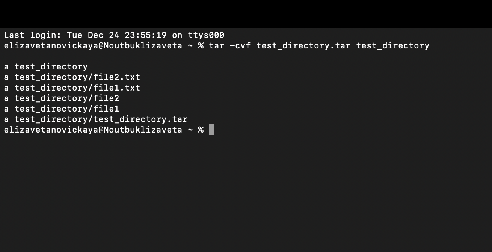

# Новицкая Елизавета Максимовна К3162 
# Отчет по созданной лабораторной работе 

1) Я установила gpg через homebrew по примеру в отчете:

2) Проверка:

3) Далее создала текстовый файл `tekst.txt`

4) Открыла терминал и набрала указанную в задании команду `gpg -c tekst.txt` , чтобы зашифровать файл, далее система потребовала придумать пароль, моим паролем было мое имя - Елизавета. 

5) Затем я ввела команду `nano tekst.txt.gpg` чтобы проверить шифровку

 
Текст зашифрован

6) Я расшифровала файл, используя команду из задания, система вновь попросила пароль

7) Я создала каталог, файлы, а так же текст в них.

8) Затем архив, по указанной команде

9) Далее зашифровала его через  `gpg -c test_directory.tar`, появился файл `test_directory.tar.gpg`, который я разархивировала через `gpg test_directory.tar.gpg`, где находились зашифрованные файлы

**Таким образом я закончила лабораторную работу, обучившись новым знаниям в этой сфере**